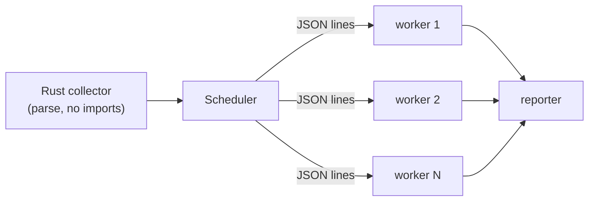

<div align="center">

<picture>
  <source media="(prefers-color-scheme: dark)" srcset="assets/logo-dark.svg">
  
</picture>

# tezt

**An extremely fast Python test runner, written in Rust.**

[](https://github.com/BilagoNet/tezt/actions/workflows/ci.yml)
[](LICENSE)
[](#status)

*"tez" means "fast" in Uzbek, and tezt sounds like "test". That's the whole pitch.*

</div>

---

tezt runs Python tests. It is built around two ideas that make it quick: it discovers
your tests by **parsing them in Rust** — no imports, no plugin loading — and it runs them
on a **pool of Python workers that start once and stay warm**, so you pay interpreter
startup a handful of times per run instead of once per test.

The difference shows up on anything non-trivial. On a generated suite of 10,000 tests
across 500 files, listing the tests takes tezt about **20 ms** where pytest takes about
**10 s**, and the full run takes **~0.2 s** against pytest's **~13 s**. Numbers and how to
reproduce them are in [Performance](#performance).

It aims to run ordinary pytest-style suites without changes — fixtures, `parametrize`,
marks, `conftest.py`, async tests, the xunit `setup_*`/`teardown_*` hooks — and it reads
both the attributes pytest's decorators produce and a small built-in [`import tezt`](#using-an-existing-suite)
API, so a project that doesn't have pytest installed can still run its tests under tezt.

## Status

Alpha. The core runner is stable and the test suite runs on **Linux, macOS, and Windows**
against **CPython 3.9 through 3.14** (every push is checked across that matrix in CI). What
isn't done yet — the plugin ecosystem, coverage, full AST assertion rewriting — is listed
honestly in [Compatibility](#compatibility) and the [Roadmap](#roadmap). If your suite leans
on the pytest plugin ecosystem, keep using pytest; see the [FAQ](#faq).

## Quickstart

```python
# test_math.py
import tezt


def test_addition():
    assert 1 + 1 == 2


@tezt.parametrize("n,squared", [(2, 4), (3, 9), (4, 16)])
def test_squares(n, squared):
    assert n * n == squared


def test_wrong_addition():
    total = 2 + 2
    assert total == 5
```

Point tezt at the directory (or just run it with no arguments in your project):

```console
$ tezt
collected 5 tests in 6ms
python: .venv/bin/python3

FAILED test_math.py::test_wrong_addition
  assert failed: assert total == 5 | locals: total=4
  Traceback (most recent call last):
    File "test_math.py", line 15, in test_wrong_addition
      assert total == 5
  AssertionError

4 passed, 1 failed in 0.07s
```

`tezt -v` prints a line per test instead of a progress counter; `tezt -q` prints only the
summary. The exit code follows pytest's convention — `0` all passed, `1` failures or
errors, `5` nothing collected — so it drops into CI unchanged.

## Using an existing suite

There are two ways to write tests, and tezt understands both.

**The built-in API**, which needs nothing installed:

```python
import tezt

@tezt.fixture
def client():
    c = make_client()
    yield c
    c.close()

@tezt.parametrize("value", [1, 2, 3])
def test_positive(value, client):
    assert client.check(value) > 0
```

`tezt` provides `fixture`, `parametrize`, `mark.skip`/`skipif`/`xfail`, `raises`, `skip`,
`fail`, and `xfail`, plus the builtin fixtures `tmp_path`, `tmp_path_factory`, and
`monkeypatch`.

**Plain pytest-style tests** also work — tezt recognizes the markers `@pytest.fixture`
and `@pytest.mark.*` leave on your functions. The one caveat is the obvious one: a file
that says `import pytest` needs pytest installed to import, because tezt does not fake the
`pytest` module. If you want a zero-dependency suite, use `import tezt`.

## Compatibility

tezt is not a pytest reimplementation; it's a fast runner for the common subset. Here's
where the line currently sits.

| Works today | Not yet |
| --- | --- |
| `test_*.py` / `*_test.py`, `test_*` functions, `Test*` classes | Installed pytest plugins (`pytest-mock`, `-django`, `-xdist`, …) |
| Fixtures: function / class / module / session scope, `yield` teardown, `conftest.py` chains | Full AST assertion rewriting (chained comparisons, call operands) |
| `async def` tests **and** async fixtures, sharing one worker event loop | `--pdb` post-mortem on failure |
| `parametrize`, including stacked decorators and `ids=` | |
| Mark expressions (`-m "slow and not net"`) and `-k` name expressions | |
| `--lf` / `--ff` (last-failed / failed-first) | |
| Coverage via `coverage.py` — `--cov` with term / html / xml reports | |
| conftest `pytest_*` hooks: `configure`, `sessionstart`/`sessionfinish`, `runtest_setup`/`runtest_teardown` | |
| Rich operator-aware assertion diffs (`==`, `!=`, `in`, lists/dicts/sets/strings) | |
| `skip` / `skipif` / `xfail` / `xpass` | |
| xunit hooks: `setup_module`, `setup_class`, `setup_method`, and teardowns | |
| Builtins: `tmp_path`, `tmp_path_factory`, `monkeypatch` | |
| Reads `@pytest.fixture` / `@pytest.mark.*`, or the zero-dep `import tezt` API | |

When a bare `assert` fails, tezt shows an operator-aware diff: for `assert a == b` (and
`!=`, `<`, `in`, `is`, …) it prints both operands and a type-aware diff — the differing
index of a list, the changed key of a dict, a unified diff of two strings. It captures the
values by re-evaluating the two sides, so when an operand contains a call (where
re-evaluation could have side effects) it falls back to the source line plus the locals in
scope rather than risk running your code twice. That's a deliberate trade against pytest's
import-time AST rewriting: chained comparisons and side-effecting operands degrade to the
plain form instead of misreporting.

## Performance

Median of 5 end-to-end runs (wall time around `subprocess.run`) on an 11-core Apple Silicon
machine, against a generated suite of **10,000 tests in 500 files**. The collection cache is
turned off here so this is an honest parse-versus-import comparison; the harness lives in
[`bench/`](bench/) and the full table is regenerated into [`bench/RESULTS.md`](bench/RESULTS.md).

| Phase | tezt | pytest | pytest -n 8 (xdist) |
| --- | ---: | ---: | ---: |
| Collect (`--collect-only`) | **0.019 s** | 10.11 s | — |
| Full run | **0.19 s** | 13.27 s | 19.53 s |
| Cold start (1 test) | **0.061 s** | 0.58 s | — |

A couple of things worth saying plainly. The collection gap is large because pytest imports
every module to discover tests while tezt only parses them. The full-run gap is mostly the
per-test overhead: tezt spends about **0.02 ms** of its own time per test, so on trivial
tests the wall time is dominated by interpreter and dispatch costs that the warm worker pool
amortizes away. And `pytest -n 8` is *slower* than plain pytest on this suite — xdist's
per-process distribution costs more than the tests themselves when each test is cheap, which
is exactly the workload persistent workers are built for. On tests that actually do work, the
gap narrows to whatever your test bodies cost, as it should.

The collection cache (on by default) takes this further on repeat runs: unchanged files skip
parsing entirely and are reconstructed from a per-file entry keyed on size and mtime. That's
another ~1.5× on this trivial suite and considerably more on real files where parsing isn't
free.

## CLI reference

| Flag | Description |
| --- | --- |
| `-k EXPRESSION` | Run only tests whose id matches the expression (`and` / `or` / `not`, parentheses) |
| `-m MARKEXPR` | Run only tests whose marks match the expression (e.g. `slow and not net`) |
| `--lf` / `--last-failed` | Run only the tests that failed last run (all of them, if none did) |
| `--ff` / `--failed-first` | Run last run's failures first, then everything else |
| `-x` / `--maxfail N` | Stop after the first failure, or after N failures/errors |
| `-j N` / `--jobs N` | Number of worker processes (default: CPU count) |
| `-v` / `-q` | One line per test / summary only |
| `-s` / `--no-capture` | Don't capture test stdout/stderr |
| `--collect-only` | List the tests that would run, then exit |
| `--durations N` | Print the N slowest tests |
| `--timeout SECONDS` | Kill and report any test that runs longer than this (off by default) |
| `--json PATH` | Write a machine-readable JSON report |
| `--cov` | Measure coverage with `coverage.py` and report after the run (needs the `coverage` package) |
| `--cov-source SRC` | Limit coverage to a package or directory (repeatable; default: the rootdir) |
| `--cov-report KIND` | `term`, `term-missing` (default), `html`, or `xml` (repeatable) |
| `--cov-branch` | Also measure branch coverage |
| `--python EXE` | Interpreter for the workers (also `$TEZT_PYTHON`); accepts a path or an `X.Y` version |
| `--no-cache` / `--clear-cache` | Skip / delete the collection cache for this run |
| `--color WHEN` | `auto` (default), `always`, or `never` |

## Configuration

tezt is configured by flags and a few environment variables; there is no config file yet.

- **`TEZT_PYTHON`** — the interpreter to run workers with. When unset, tezt looks for an
  active virtualenv (`$VIRTUAL_ENV`), then `$CONDA_PREFIX`, then a project-local `.venv`
  (walking up to the project root), then `python3`/`python` on `PATH`. This is why tests run
  against the dependencies you actually installed rather than the system interpreter.
- **`NO_COLOR`** — disables color, same as `--color never` (respects the [standard](https://no-color.org)).
- **`TEZT_DEBUG=1`** — logs internal detail to stderr, including any file whose static parse
  fell back to import-time discovery.
- **`.tezt_cache/`** — the per-project collection cache. It's safe to delete and is marked so
  backup tools skip it; add it to `.gitignore` (tezt writes one inside the directory too).

## Installation

> The one-line and `pip` installs need a published release. Until the first one lands, build
> from source (last option) — the release pipeline below is wired up and ready.

**One line** — downloads the right prebuilt binary for your platform and puts it on PATH:

```sh
# Linux / macOS
curl -fsSL https://raw.githubusercontent.com/BilagoNet/tezt/main/install.sh | sh
```

```powershell
# Windows (PowerShell)
irm https://raw.githubusercontent.com/BilagoNet/tezt/main/install.ps1 | iex
```

Set `TEZT_INSTALL_DIR` to pick the location or `TEZT_VERSION` to pin a tag.

**With Python tooling** — the binary ships inside a wheel, so no Rust toolchain is needed:

```sh
pip install tezt          # or:  uv tool install tezt
```

**Direct download** — grab a `tezt-<target>.tar.gz` / `.zip` from the
[Releases](https://github.com/BilagoNet/tezt/releases) page and put the binary on your PATH.

**From source** — any platform with a recent stable Rust toolchain:

```sh
git clone https://github.com/BilagoNet/tezt
cd tezt
cargo build --release     # binary at ./target/release/tezt
```

## How it works

Collection and execution are split between the two languages, each doing what it's good at.

Collection stays entirely in Rust: a parser walks each test file's syntax tree and builds the
list of tests directly, so discovering a suite never starts a Python interpreter. Execution
runs on a pool of worker processes that import each module once and then sit waiting for work,
talking to the scheduler over a line-delimited JSON protocol on stdin/stdout. Because the
workers are persistent, the cost of dispatching one more test is a JSON write and read —
well under a millisecond — instead of a process launch.



Interrupting a run is handled carefully, because a half-killed run that leaves Python
processes behind is worse than no speedup at all. Each worker runs in its own process group on
Unix and inside a kill-on-close Job Object on Windows, and a Ctrl-C handler tears the whole
tree down — so an interrupted run never orphans a worker or a subprocess one of your tests
spawned.

## Roadmap

Roughly in the order it's likely to happen:

- [ ] Full AST assertion rewriting (chained comparisons, call operands)
- [ ] `--pdb` post-mortem on failure
- [ ] Installed pytest-plugin compatibility (entry points), beyond conftest hooks

## FAQ

**Should I switch off pytest?**
For most projects, no — pytest is mature, extensible, and has an enormous plugin ecosystem
that tezt doesn't try to replace. tezt is for the cases where the test loop itself is the
bottleneck: large suites, tight edit-run cycles, CI minutes. If you live in those, the
collection and startup savings are hard to give up; if you don't, pytest is the safer choice.

**Will my existing suite run?**
If it sticks to fixtures, `parametrize`, marks, and `conftest.py`, there's a good chance it
runs unchanged. If it depends on the plugin ecosystem (including coverage), it won't yet —
the [compatibility table](#compatibility) is the honest boundary.

**How is this different from karva, rtest, or maelstrom?**
They're all worth a look — this is a small wave of people asking what Rust can do for Python
testing, the way uv and ruff did for packaging and linting. tezt's particular bet is the
combination of static (no-import) collection, a warm worker pool with sub-millisecond
dispatch, and running ordinary suites with no configuration.

## Contributing

See [CONTRIBUTING.md](CONTRIBUTING.md). The short version: `cargo test` runs the Rust unit
and integration tests, `python python/test_worker_protocol.py` exercises the worker protocol
directly, and `bench/` has the benchmark harness. CI runs all of it across the OS and Python
matrix.

## Acknowledgements

tezt borrows pytest's design and ergonomics — its test layout, fixtures, and marks set the
bar this tries to meet. The architecture takes after [Astral](https://astral.sh)'s
[uv](https://github.com/astral-sh/uv) and [ruff](https://github.com/astral-sh/ruff): a fast
Rust core doing the heavy lifting for a Python workflow.

## License

[MIT](LICENSE).
