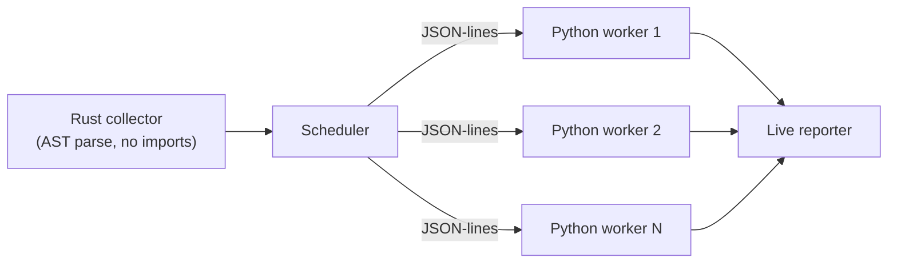

<div align="center">

# tezt

**An extremely fast Python test runner, written in Rust.**

[](https://github.com/BilagoNet/tezt/actions/workflows/ci.yml)
[](LICENSE)
[](#roadmap)

*"tez" means "fast" in Uzbek. tezt sounds like "test". That's the whole pitch.*

</div>

---

## Highlights

- ⚡ **Near-instant collection.** Test files are parsed with a Rust AST parser — no Python imports needed to discover your tests.
- 🚀 **Parallel by default.** Tests run on a pool of persistent Python worker processes (`-j N`), so interpreter startup cost is paid once, not per test.
- 🔍 **pytest-style discovery.** `test_*.py` / `*_test.py` files, `test_*` functions, `Test*` classes — your suite layout just works.
- 🧩 **Fixtures, parametrize, marks.** Function/module/session-scoped fixtures with yield teardown, `conftest.py`, `parametrize`, `skip`/`skipif`/`xfail`, async tests, and xunit setup/teardown hooks.
- 🤝 **Works with pytest decorators.** `@pytest.fixture` and `@pytest.mark.parametrize` are understood without pytest installed — or use the zero-dependency `import tezt` API.
- 🛠 **Builtins included.** `tmp_path`, `tmp_path_factory`, and `monkeypatch` work out of the box.
- 📋 **Rich failures.** Assertion failures are enriched with the failing source line and local variables.
- 🔢 **pytest-compatible exit codes** (`0` pass, `1` failures, `5` no tests collected) for drop-in CI use.

## Benchmarks

<!-- BENCH:START -->
_Benchmarks coming soon._
<!-- BENCH:END -->

## Installation

tezt is alpha software. For now, build from source:

```sh
git clone https://github.com/BilagoNet/tezt
cd tezt
cargo build --release
# binary at ./target/release/tezt
```

Prebuilt binaries and `uv tool install tezt` are coming soon.

## Quickstart

Write tests the way you already do:

```python
# test_math.py
import pytest


def test_addition():
    assert 1 + 1 == 2


@pytest.mark.parametrize("n,squared", [(2, 4), (3, 9), (4, 16)])
def test_squares(n, squared):
    assert n * n == squared


def test_wrong_addition():
    total = 2 + 2
    assert total == 5
```

Run them:

```sh
tezt
```

```text
tezt 0.1.0 — collected 5 tests in 0.002s (2 workers)

test_math.py::test_addition PASSED
test_math.py::test_squares[2-4] PASSED
test_math.py::test_squares[3-9] PASSED
test_math.py::test_squares[4-16] PASSED
test_math.py::test_wrong_addition FAILED

FAILURES ────────────────────────────────────────────────

test_math.py::test_wrong_addition
    assert total == 5
    locals: total = 4

──────────────────────────────── 4 passed, 1 failed in 0.09s
```

## pytest compatibility

tezt aims to run idiomatic pytest suites unmodified. Many real-world suites work today; suites that lean on plugins or pytest internals do not (yet).

| Supported | Not yet |
| --- | --- |
| Discovery: `test_*.py`, `*_test.py`, `test_*` functions, `Test*` classes | pytest plugin ecosystem |
| Fixtures: function / module / session scope, yield teardown, `conftest.py` | Assertion rewriting (pytest's introspection magic) |
| `@pytest.mark.parametrize` | Custom marks API |
| `skip` / `skipif` / `xfail` / `xpass` | `pdb`, `--lf`, `--ff` |
| Async tests | Coverage integration |
| xunit setup/teardown hooks (`setup_method`, `setup_class`, …) | Class-scoped fixtures |
| Builtin `tmp_path`, `tmp_path_factory`, `monkeypatch` | Async fixtures |
| `@pytest.fixture` & friends — no pytest install required | |
| Zero-dep `import tezt` API | |
| Exit codes `0` / `1` / `5` | |

## CLI reference

| Flag | Description |
| --- | --- |
| `-k EXPRESSION` | Only run tests matching the expression |
| `-x`, `--maxfail` | Stop after the first failure (or after N failures) |
| `-j N`, `--jobs N` | Number of parallel worker processes |
| `-v` / `-q` | Increase / decrease output verbosity |
| `--collect-only` | Collect and list tests without running them |
| `--json` | Emit a machine-readable JSON report |
| `--no-capture` | Don't capture stdout/stderr from tests |
| `--durations` | Show the slowest tests |

## How it works

tezt splits the work between Rust and Python. Collection never touches a Python interpreter: a Rust AST parser scans your test files and builds the test list directly. Execution happens on a pool of persistent Python workers that stay warm between tests, communicating with the scheduler over a JSON-lines protocol — so per-test dispatch overhead is amortized to well under a millisecond.



## Roadmap

- [ ] Assertion rewriting
- [ ] Plugin API
- [ ] Watch mode
- [ ] Coverage integration
- [ ] Mark expressions (`-m`)
- [ ] pip / uv distribution
- [ ] Class-scoped fixtures

## FAQ

**Why not just use pytest?**
You probably should, for most projects — pytest is mature, extensible, and battle-tested. tezt exists for the cases where test-loop latency matters: huge suites, tight TDD loops, CI bills. Collection that takes pytest seconds takes tezt milliseconds, and persistent workers remove the per-run interpreter tax.

**How is this different from karva, rtest, or maelstrom?**
Honestly: we're all part of the same wave of exploring what Rust tooling can do for Python testing, the way uv and ruff did for packaging and linting. tezt's particular bet is the combination of persistent-worker amortized sub-millisecond dispatch and zero-config pytest-style UX — point it at an existing suite and it should just run, fast.

**Does my existing pytest suite work?**
Many do. If your suite uses standard fixtures, parametrize, marks, and conftest.py, there's a good chance it runs unmodified. If it depends on pytest plugins (pytest-mock, pytest-django, pytest-cov, …) or assertion-rewriting magic, it won't yet — see the compatibility table above.

## Acknowledgements

- [Astral](https://astral.sh)'s [uv](https://github.com/astral-sh/uv) and [ruff](https://github.com/astral-sh/ruff), which showed what Rust tooling for Python can feel like — and whose READMEs this one openly imitates.
- [pytest](https://pytest.org), whose design tezt borrows liberally and whose ergonomics set the bar.
- Bootstrapped with [Claude](https://claude.ai).

## License

tezt is licensed under the [MIT License](LICENSE).
